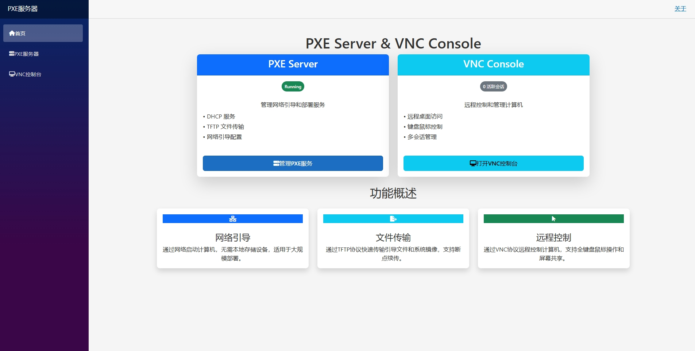
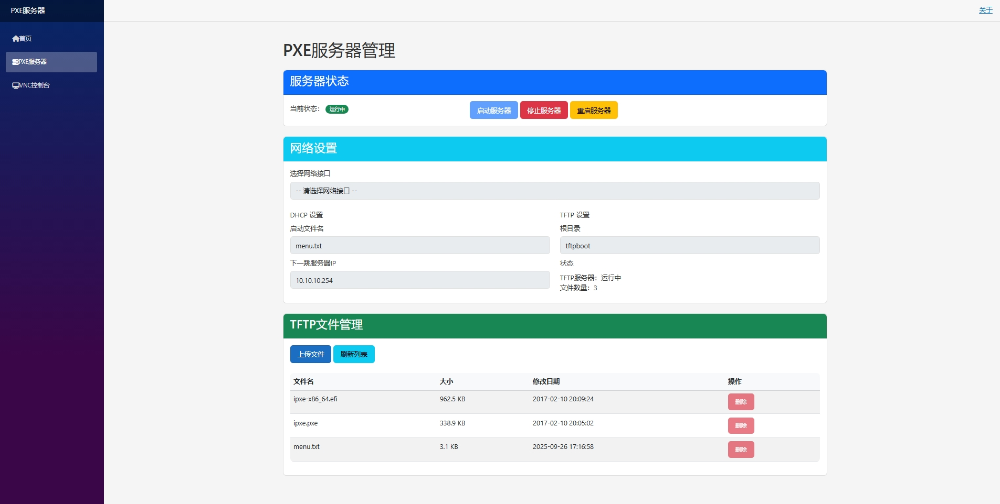
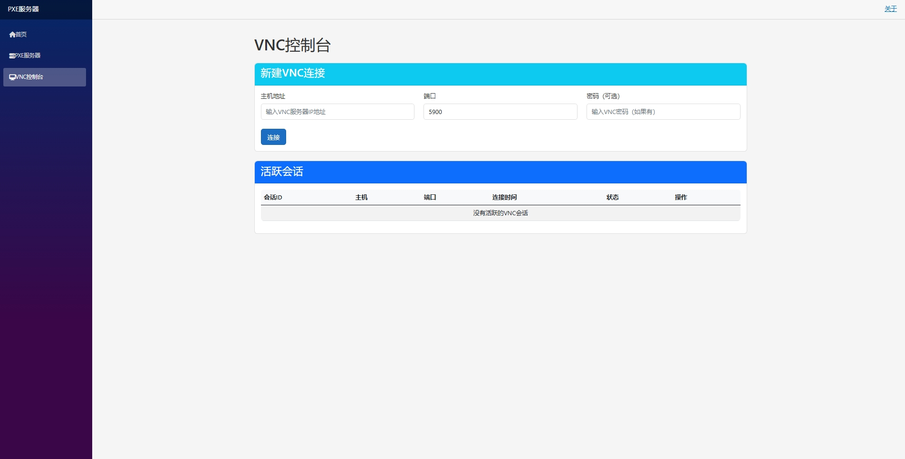

# EasyPxeServer

EasyPxeServer 是一个基于 .NET Core 和 Blazor Server 的 PXE 服务器管理系统，提供了 DHCP、TFTP 服务以及 VNC 远程控制功能，帮助用户轻松管理网络启动和远程服务器操作。

## 功能特性

### 1. PXE 服务器管理
- **DHCP 服务**：配置和管理 DHCP 服务，支持 IP 地址分配和 PXE 启动选项设置
- **TFTP 服务**：提供文件传输服务，用于传输 PXE 启动所需的镜像和配置文件
- **网络接口选择**：支持选择特定的网络接口来运行服务
- **一键启动/停止**：简单易用的界面控制服务器状态

### 2. VNC 控制台
- **VNC 连接管理**：创建、查看和管理多个 VNC 连接
- **远程屏幕控制**：通过 Web 界面直接控制远程服务器
- **会话管理**：支持查看活跃会话和断开连接

### 3. Web 界面
- 基于 Blazor Server 的响应式界面
- 实时状态显示
- 直观的配置选项

## 界面预览

### 首页


### PXE 服务器管理页面


### VNC 控制台


## 技术栈

- **后端框架**：.NET Core
- **前端框架**：Blazor Server
- **DHCP 服务库**：DotNetProjects.DhcpServer (v2.0.26)
- **TFTP 服务库**：Tftp.Net (v1.3.0)
- **VNC 客户端**：Community.MarcusW.VncClient.Blazor (v2.0.0-alpha5)
- **日志系统**：Serilog

## 特别感谢

特别感谢以下开源库的开发者，没有这些优秀的库，这个项目将无法实现：

- **Tftp.Net**：提供了完整的 TFTP 协议实现，支持读取、写入和列出等操作。
- **DotNetProjects.DhcpServer**：提供了 DHCP 服务器功能，支持 IP 地址分配和 PXE 启动选项设置。
- **Community.MarcusW.VncClient**：提供了 VNC 客户端功能，支持通过 Web 界面远程控制服务器。

这些库可以在 [NuGet](https://www.nuget.org/) 上找到，您也可以通过搜索它们的名称在 GitHub 上找到相应的开源仓库。

## 快速开始

### 前提条件
- 安装 .NET Core SDK
- 管理员权限（运行 DHCP 和 TFTP 服务需要）

### 运行项目

1. 克隆仓库：
```bash
# 克隆代码仓库到本地
```

2. 构建项目：
```bash
dotnet build
```

3. 运行项目：
```bash
dotnet run --project src/EasyPxeServer.csproj
```

4. 访问 Web 界面：
   打开浏览器，访问 `https://localhost:5001` 或 `http://localhost:5000`

## 配置说明

### 应用配置

应用的主要配置位于 `appsettings.json` 文件中：

```json
{
  "Logging": {
    "LogLevel": {
      "Default": "Information",
      "Microsoft.AspNetCore": "Warning"
    }
  },
  "AllowedHosts": "*"
}
```

日志配置可在 `appsettings.log.json` 中进行自定义。

### PXE 配置

通过 Web 界面进行配置：
1. 选择网络接口
2. 设置 DHCP 选项（启动文件名、下一跳服务器 IP 等）
3. 设置 TFTP 根目录

### TFTP 文件结构

确保在 TFTP 根目录下包含必要的 PXE 启动文件。默认情况下，TFTP 根目录为 `tftpboot`。

## 使用指南

### PXE 服务器管理

1. 打开 PXE 服务器管理页面 (`/pxe`)
2. 从下拉列表中选择网络接口
3. 配置 DHCP 和 TFTP 服务参数
4. 点击 "启动服务器" 按钮
5. 服务器启动后，可以监控状态和管理服务

### VNC 控制台使用

1. 打开 VNC 控制台页面 (`/vnc`)
2. 输入 VNC 服务器的主机地址、端口和密码（如果需要）
3. 点击 "连接" 按钮
4. 连接成功后，可以在页面上直接控制远程服务器
5. 可以在活跃会话列表中查看和管理所有 VNC 连接

## 项目结构

```
src/
├── App.razor                  # 应用入口组件
├── Components/                # 自定义组件
│   └── VncView.razor          # VNC 视图组件
├── Controllers/               # API 控制器
│   └── TftpFileController.cs  # TFTP 文件管理控制器
├── Pages/                     # 页面组件
│   ├── Index.razor            # 首页
│   ├── Pxe.razor              # PXE 服务器管理页面
│   └── Vnc.razor              # VNC 控制台页面
├── Services/                  # 服务类
│   ├── DHCPService.cs         # DHCP 服务
│   ├── TFTPService.cs         # TFTP 服务
│   ├── VncService.cs          # VNC 服务
│   └── PxeServerService.cs    # PXE 服务器管理服务
└── wwwroot/                   # Web 静态资源
```

## 注意事项

1. 运行 DHCP 和 TFTP 服务需要管理员/root 权限
2. 确保所选网络接口未被其他 DHCP 服务占用
3. TFTP 服务默认使用端口 69，确保该端口未被占用
4. 日志文件默认保存在应用程序目录下的 `log.txt` 文件中

## License

[MIT](LICENSE)